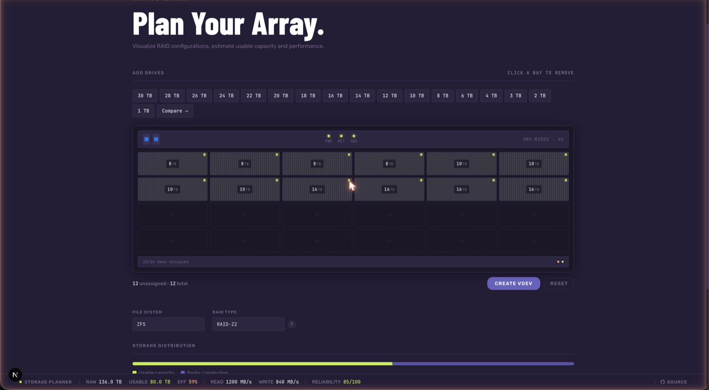

# Storage Planner
<div align="center">
  
  <br>
</div>

## Overview

Storage Planner is a web app for planning and visualizing RAID storage configurations. Whether you're building a home NAS, designing a ZFS pool, or comparing redundancy strategies, it gives you usable capacity, formatted size, read/write speed estimates, and a reliability score — all in real time.

<div align="center">
  
</div>

## Platform Support

Storage Planner Docker images are built for multiple architectures:

- `linux/amd64` — Standard x86_64 systems
- `linux/arm64` — 64-bit ARM (Raspberry Pi 4, AWS Graviton, Apple Silicon)
- `linux/arm/v7` — 32-bit ARM (Raspberry Pi 3 and earlier)

Docker automatically pulls the correct image for your architecture.

## Quick Start

### Using Docker

```bash
docker pull ghcr.io/buildthehomelab/storage-planner:latest
docker run -p 3000:3000 ghcr.io/buildthehomelab/storage-planner:latest
```
Visit `http://localhost:3000` in your browser.

## Features

- **Multiple file system support**
  - ZFS with custom vdev configuration (RAID-Z1/Z2/Z3, Mirror, Striped)
  - Unraid (1–3 parity drives)
  - Synology SHR and Synology BTRFS
  - SnapRAID (1–6 parity)
  - Standard RAID (0, 1, 5, 6, 10)

- **Interactive drive visualization**
  - Server rack bay UI — up to 24 bays, supports 1–30 TB drives
  - ZFS vdev builder with visual grouping

- **Detailed performance metrics**
  - Estimated read/write speeds
  - Usable capacity and storage efficiency
  - Reliability score (0–100)
  - Raw vs. formatted capacity

- **Side-by-side comparison mode**
  - Compare two configurations across capacity, efficiency, read/write speed, and reliability

- **Educational resources**
  - Inline explanations of RAID types, ZFS vdevs, and SnapRAID

## Technologies

- **Framework**: Next.js 15 (App Router)
- **UI**: React 18
- **Styling**: Tailwind CSS
- **Containerization**: Docker

## Use Cases

- **Home NAS planning** — Visualize storage configurations before buying hardware
- **ZFS pool design** — Experiment with vdev layouts for performance and redundancy
- **Upgrade planning** — Calculate the benefit of adding drives to an existing array
- **Learning** — Understand RAID levels and their trade-offs interactively

## Contributing

Contributions are welcome!

1. Fork the repository
2. Create a feature branch (`git checkout -b feature/my-feature`)
3. Commit your changes
4. Push to the branch
5. Open a Pull Request

## License

Apache 2.0 — see the [LICENSE](LICENSE) file for details.

## Acknowledgements

- [ZFS Documentation](https://openzfs.github.io/openzfs-docs/)
- [Synology Knowledge Base](https://www.synology.com/en-global/knowledgebase)
- [SnapRAID Documentation](https://www.snapraid.it/manual)
- [Unraid Documentation](https://wiki.unraid.net/)

---

<div align="center">
  © 2026 Storage Planner · buildthehomelab.com
</div>
